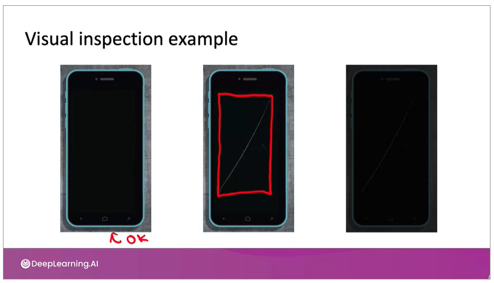
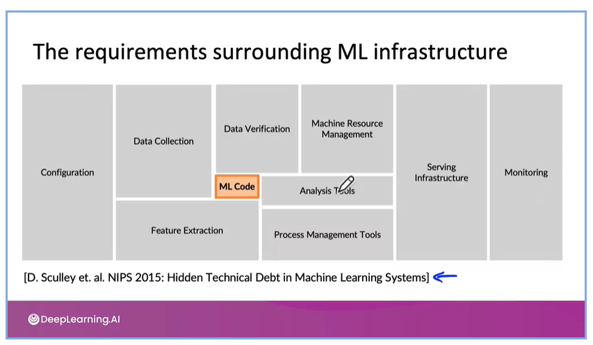
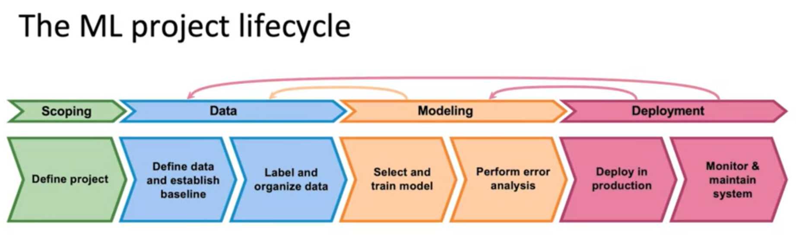
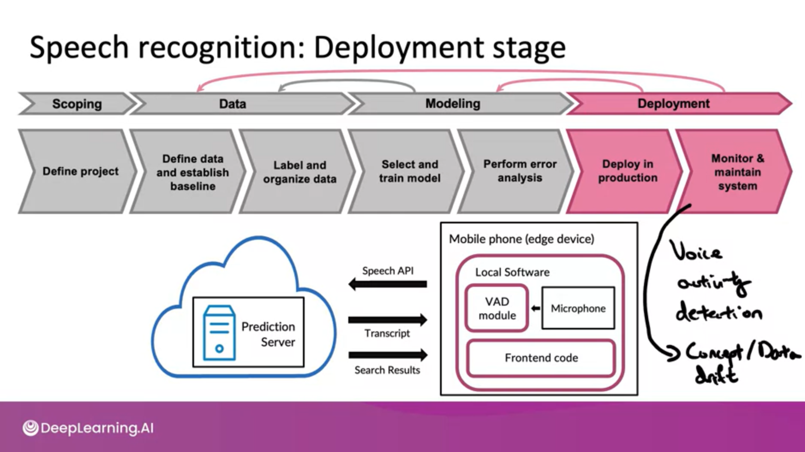

# The machine Learning Project Lifycycle

## The machine learning project lifecycle

What are the Challenges
- Concept drift or data drift: Lighting in the factory different that when the training set was collected.

- POC to Production Gap - ML project needs a lot more code than the ML code.  

The ML project Lifecycle
- Scoping - Why? What is X and Y? guestimate key metrics
- Collect data - define data, establish a baseline, label and organize data, 
- Train a model - select, train and perform error analyis (might require to go back), audit the system
- Deploy - deploy in production, monitor the system, track the data and maintain the system. 

Case study - Speech Recognition

